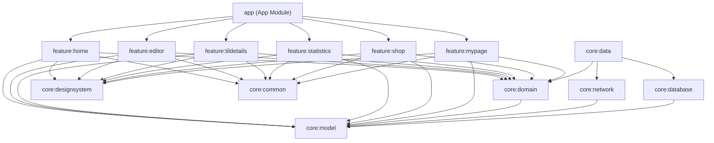

# 🐾 Tilly — AI 학습 기록 동반자


> 매일의 배움을 기록하고, AI 친구 틸리(Tilly)와 함께 성장하세요!

**Tilly**는 개발자를 위한 **TIL(Today I Learned)** 학습 기록 안드로이드 앱입니다. 
매일 배운 내용을 기록하면 AI가 자동으로 감정·난이도를 분석하고 피드백을 제공하며, 코인·상점·통계 시스템으로 꾸준한 학습 습관을 재미있게 유지할 수 있도록 도와줍니다.
 
<br>

## ✨ 주요 기능 (Core Features)

### 1. ✍️ 스마트한 TIL 기록 & AI 피드백

- **핵심 중심 기록**: 제목, 배운 점, 어려운 점, 내일 할 일을 나누어 체계적인 회고 유도
- **오프라인 모드**: 인터넷 연결 없이도 안전하게 초안 작성 가능
- **AI 맞춤 피드백 (OpenAI 연동)**: 작성된 텍스트를 기반으로 주요 **키워드(Tag)** 를 추출하고, 5단계의 **감정 상태**와 **체감 난이도**를 스캔하여 틸리만의 다정한 한마디(Feedback)를 남겨줍니다.

### 2. 🎮 코인 & 상점 시스템 (나만의 데스크 꾸미기)

- **코인 획득**: 출석, 새로운 TIL 작성 등 미션을 통해 보상 코인 획득
- **상점 (Shop)**: 모니터, 키보드, 의자, 책상, 식물 등 다채로운 아이템 구매 및 장착
- **실시간 적용**: 구매한 아이템과 테마가 홈 화면 최상단에 즉시 반영되어 나만의 개발 공간을 꾸미는 재미 제공

### 3. 📈 학습 통계 & 월간 회고

- **감정 트렌드 (Line Chart)**: 한 달간의 학습 심리 상태 변화 추적
- **키워드 분석 (Donut Chart)**: 어떤 기술 스택을 많이 공부했는지 시각화
- **체감 난이도 분포 (Bar Chart)**: 학습 효율 점검
- **AI 월간 리포트**: 한 달 동안 작성된 TIL 데이터를 바탕으로 종합적인 성과 분석(성장 포인트, 개선점, 넥스트 스텝) 리포트 발행

### 4. 🎨 커스텀 테마 & 다크 모드

- 눈이 편안한 개발 환경을 위해 **다크 모드 강제 고정** 적용
- 7종의 인기 에디터 테마 지원: `Tilly Green(기본)`, `Dracula`, `Monokai`, `One Dark`, `Nord`, `Gruvbox`, `Solarized`

### 5. 🏠 마이페이지

- 주간 학습 체크 · 연속 학습일 · 총 TIL 수
- 연속 학습 보상 진행 바
- 코인 거래 내역
- 알림 설정 · 오픈소스 라이선스

### 6. ⏰ 위젯 & 리마인더

- **주간 체크 위젯 (Glance)**: 홈 화면에서 이번 주 학습 현황(Streak)을 바로 확인
- **푸시 알림 (WorkManager)**: 사용자가 설정한 시간에 맞춰 학습 리마인더 및 내일의 계획 알림 발송
<br>

## 🏗️ 아키텍처

```

app                          ← 앱 진입점 & 네비게이션
├── feature/                 ← UI 레이어 (화면별 모듈)
│   ├── home                    홈 화면 (TIL 피드 + 틸리의 방)
│   ├── editor                  TIL 작성 / 편집
│   ├── tildetails              TIL 상세 보기
│   ├── statistics              통계 & 차트 & 월간 회고
│   ├── shop                    상점
│   └── mypage                  마이페이지 & 코인 내역
├── core/                    ← 공통 레이어
│   ├── model                   도메인 모델
│   ├── domain                  UseCase & Repository 인터페이스
│   ├── data                    Repository 구현체
│   ├── database                Room DB (DAO, Entity)
│   ├── datastore               DataStore (사용자 설정)
│   ├── network                 Retrofit API (OpenAI)
│   ├── designsystem            디자인 시스템 (Theme, Component)
│   └── common                  유틸리티 & 알림 스케줄러
└── build-logic/             ← Convention Plugins

```



<br>

## 🛠️ 기술 스택

| 영역 | 기술 |
| --- | --- |
| **Language** | Kotlin |
| **UI** | Jetpack Compose + Material 3 |
| **Navigation** | Navigation Compose (Type-Safe) |
| **DI** | Hilt + KSP |
| **DB** | Room |
| **Network** | Retrofit + OkHttp + Kotlinx Serialization |
| **비동기** | Coroutines + Flow |
| **이미지** | Coil (GIF 지원) |
| **차트** | Vico |
| **위젯** | Glance AppWidget |
| **알림** | WorkManager |
| **빌드** | Gradle Version Catalog + Convention Plugins |

| 환경 | 버전 |
| ------ | ------ |
| Min SDK | 26 (Android 8.0) |
| Target SDK | 36 |
| JDK | 17 |

<br>

## 📷 스크린샷

<table>
  <tr>
    <th align="center">홈</th>
    <th align="center">에디터</th>
    <th align="center" colspan="2">TIL 상세</th>
  </tr>
  <tr>
    <td align="center"></td>
    <td align="center"></td>
    <td align="center"></td>
    <td align="center"></td>
  </tr>
  <tr>
    <td align="center">TIL 피드 + 틸리룸</td>
    <td align="center">TIL 작성 + AI 분석</td>
    <td align="center" colspan="2">분석 결과 + 피드백</td>
  </tr>
  <tr>
    <th align="center" colspan="2">통계</th>
    <th align="center">상점</th>
    <th align="center">마이페이지</th>
  </tr>
  <tr>
    <td align="center"></td>
    <td align="center"></td>
    <td align="center"></td>
    <td align="center"></td>
  </tr>
  <tr>
    <td align="center" colspan="2">월별 차트 + 회고</td>
    <td align="center">아이템 구매/장착</td>
    <td align="center">주간체크 + 알림 설정</td>
  </tr>
</table>


